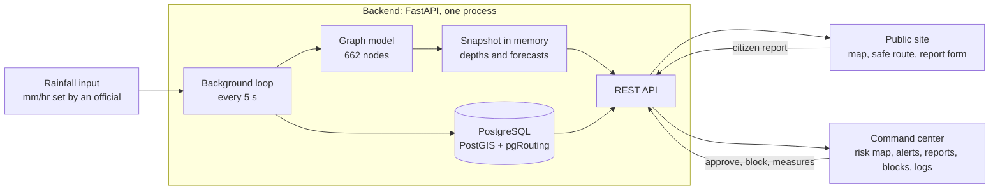
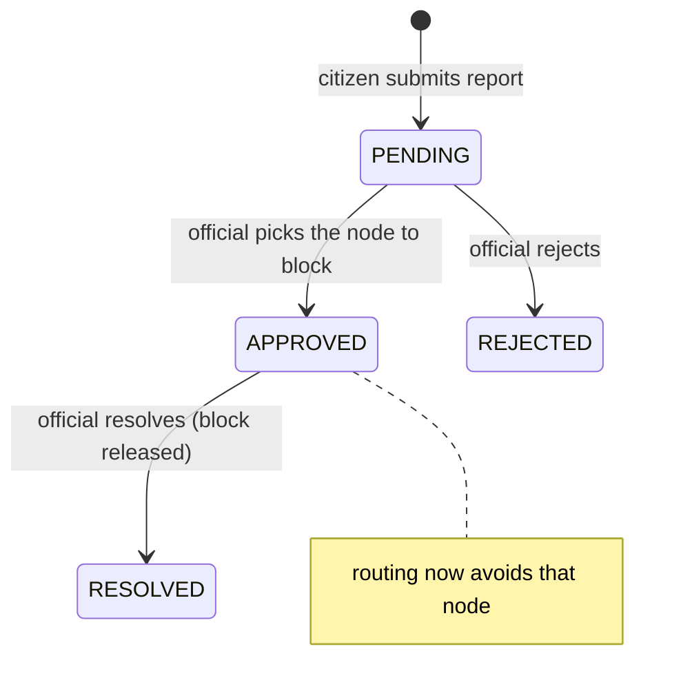

# Architecture

MeghSync has three layers: a prediction model, a backend service with a database, and two web applications (a public site and a municipal command center).

## Components

| Component | Where | What it does |
|---|---|---|
| Model | `ml/` | Predicts flood depth at 662 nodes for now, +30 min, +1 h, +2 h, +3 h. Details in `MODEL_REPORT.md`. |
| Backend | `backend/app/` | Runs the model on a timer, turns depths into risk levels and alerts, prices streets for routing, serves the API, handles login. |
| Database | `db/`, `backend/migrations/` | PostgreSQL 16 with PostGIS and pgRouting. Holds the street graph, node data, reports, blocks, alerts, logs and recent predictions. Runs the routing search. |
| Frontend | `frontend/` | React app: public pages and the municipal command center. See `FRONTEND.md`. |

## The background loop

`backend/app/services/engine.py` starts one asyncio task when the server starts. Every `INFERENCE_INTERVAL_SECONDS` (default 5) it does one **tick**:

1. Copy the current rainfall and pipe capacities (under a lock).
2. In a worker thread, run one live model step plus the forecasts for +30 min, +1 h, +2 h and +3 h.
3. In **one database transaction**: update each manhole's flood depth and flooded flag, re-price the street network around flooded or blocked nodes, and open, update or close alerts.
4. Build a new in-memory `Snapshot` and replace the old one under a lock (a single reference assignment).

API requests never run the model. They return the latest snapshot. If a tick fails the loop logs it and keeps serving the last good snapshot, and responses are marked `stale` after `STALE_AFTER_SECONDS` (default 30).

**Time model.** One tick advances the model by one 5-minute step. With the default 5-second tick the system runs 60 times faster than real time, which suits demonstrations. For real use set `INFERENCE_INTERVAL_SECONDS=300`.

**Single process.** Rainfall, model memory and the snapshot live in the memory of one process, and one loop writes to the database. Run the server with one worker. Two locks guard it: one serialises ticks, resets and block changes, the other guards the rainfall, capacities and snapshot.

## Routing

Routing is done inside PostgreSQL with pgRouting's `pgr_aStar`. The street network (OpenStreetMap) is stored in a `streets` table with a cost column per street.

* On each tick, any street within **75 m** of a node whose flood depth is above **0.15 m** (`route_block_m`), or of a node blocked by an official, gets cost = length x **10,000**.
* A request snaps the start and destination to the nearest street junction (within 250 m), then runs A* twice: once on plain length (the normal route) and once on the flood-adjusted cost (the safe route).
* Streets are never removed. If every route is flooded the safe route still returns and the response says so (`unavoidableFlood`).
* Travel time assumes 20 km/h (`ROUTE_SPEED_KMH`).

Cost updates are committed once per tick, so a route request reads either the old or the new costs, never a half-updated state.

## Citizen reports and blocked nodes

* A report may carry a map pin. If a node lies within 150 m the server suggests it, but the official always chooses the node on approval.
* An official can also block or unblock any node by hand (the Blocked Nodes panel). Blocks are stored in the database, survive restarts, and survive a normal simulation reset.
* Officials record **measures taken** against any report. Every action is written to the activity log.

## Database tables

| Table | Purpose |
|---|---|
| `users` | official accounts (password stored as a hash) |
| `node_meta` | per-node data: elevation, imperviousness, street name |
| `reports` | citizen reports, status, review note, measures |
| `blocks` | blocked nodes (manual or from a report), with who and when |
| `actions` | activity log |
| `alerts` | alerts per node with level, peak level and acknowledgement |
| `prediction_snapshots`, `node_predictions` | recent predictions (kept 7 days by default) |
| `route_requests` | anonymous route usage (coordinates rounded to about 110 m) |
| `app_config` | settings changed from the command center |

The street graph and manhole tables are created by `db/init_schema.sql` and filled by the scripts described in `db/README.md`. The `backend/migrations/*.sql` files are applied automatically at startup. Old logs, alerts and predictions are removed on a schedule (`log_retention_days`, `alert_retention_days`, `prediction_retention_days`).

## Configuration

Set in `backend/.env` (see `.env.example`).

| Setting | Default | Meaning |
|---|---|---|
| `DATABASE_URL` | local PostgreSQL on port 5433 | database connection |
| `MODEL_PROVIDER` | `gnn` | `gnn` for the real model, `mock` for a fake one (no PyTorch needed) |
| `MODEL_PATH` | `ml/checkpoints_v3/best_model_v3.pt` | which model file to load |
| `INFERENCE_INTERVAL_SECONDS` | 5 | seconds per tick |
| `STALE_AFTER_SECONDS` | 30 | when responses are marked stale |
| `ROUTE_SPEED_KMH` | 20 | speed for travel-time estimates |
| `JWT_SECRET` | none | required, at least 32 characters |
| `JWT_TTL_MINUTES` | 480 | login lifetime |
| `BOOTSTRAP_ADMIN_ID`, `BOOTSTRAP_ADMIN_PASSWORD` | empty | create the first official when the users table is empty (remove them afterwards) |
| `CORS_ORIGINS` | `http://localhost:5173` | allowed browser origins |
| `BLOCKAGE_EFFECTIVE` | false | feed pipe-capacity blockage to the model |

## Security and privacy notes

* Official endpoints require a signed token with an expiry. Login, route and report endpoints are rate limited.
* Citizen input is cleaned and length limited. Citizens see only the status of their report; phone numbers and names are visible to officials only.
* Reports contain a name, a phone number and a location. Delete old data on request and review the privacy policy before any public deployment.
* Before a public launch: change `JWT_SECRET`, remove the `BOOTSTRAP_ADMIN_*` lines, review CORS, and use a proper map-tile provider (the public OpenStreetMap tile server is not meant for heavy use).

## Known limits

* One process only, no load testing, not yet deployed to a public server.
* Rainfall is a single city-wide number entered by an official. It is designed so a gauge or radar feed could supply it, but none is connected.
* The model was trained only on synthetic storms. See `MODEL_REPORT.md`.
